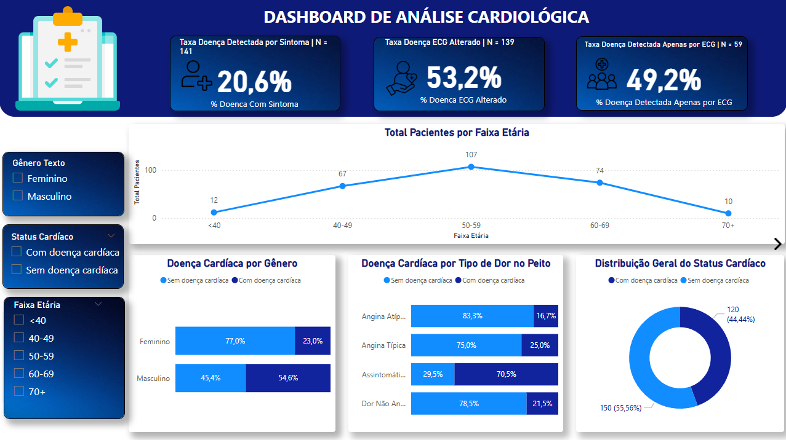
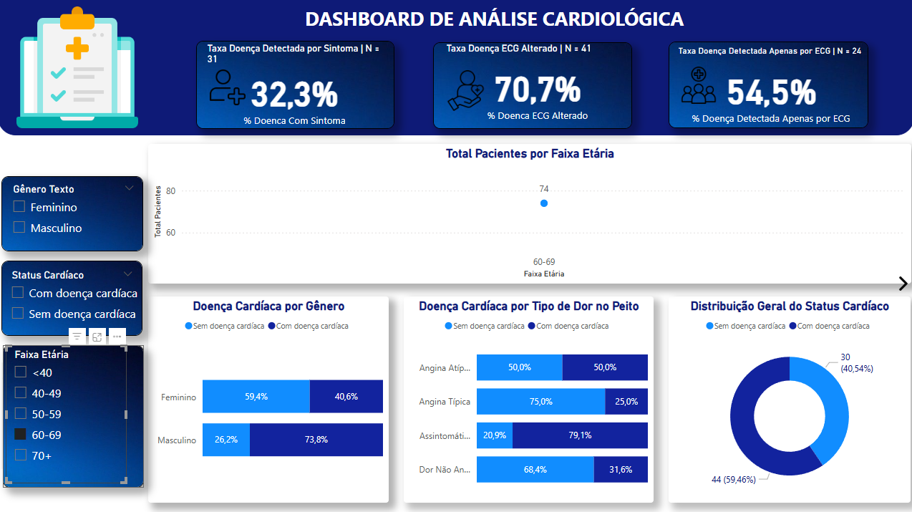
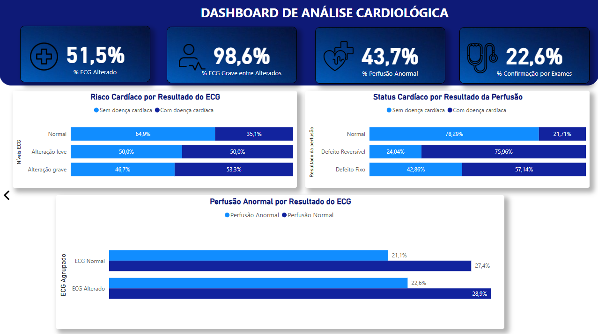

# Análise de Dados aplicada à Saúde: Risco Cardíaco

Este projeto tem como foco a aplicação de **Análise de Dados e Business Intelligence** no contexto da saúde, utilizando dados clínicos estruturados para analisar o **risco cardíaco** e a relação entre **sintomas clínicos e exames diagnósticos**.

O objetivo central é estruturar um **pipeline analítico** capaz de explorar, de forma quantitativa, **como diferentes sinais clínicos e exames contribuem para a detecção da doença cardíaca**, apoiando análises exploratórias e hipóteses orientadas por dados.

---

## 📌 Contexto Analítico

Doenças cardiovasculares estão entre as principais causas de mortalidade no mundo. Em muitos casos, o diagnóstico depende da correta interpretação de **sintomas clínicos iniciais** e da confirmação por **exames objetivos**, como ECG e exames de perfusão cardíaca.

Diante desse cenário, este projeto busca analisar:
- A efetividade dos **sintomas** na detecção da doença
- O papel dos **exames clínicos** na confirmação diagnóstica
- A complementaridade entre sinais subjetivos e exames objetivos

Obs: O projeto não tem caráter clínico ou determinístico, mas sim **exploratório**, com foco na geração de hipóteses e na compreensão analítica do problema.

---

## 🎯 Objetivos do Projeto

- Avaliar a **presença de doença cardíaca** a partir de sintomas e exames
- Analisar a **detecção da doença por sintomas clínicos**
- Investigar a **confirmação diagnóstica por exames**
- Construir **KPIs claros, consistentes e interpretáveis**
- Aplicar boas práticas de **modelagem, DAX e visualização analítica**

---

## 🗂 Estrutura do Projeto

📁 data

┣ 📁 raw

┃ ┗ heart_disease_raw.csv

┣ 📁 processed

┃ ┗ heart_disease_processed.csv

📁 analysis

┗ kpis_dax.md

┗ decisoes_analiticas.md

┗ regras_negocio.md

📁 powerbi

┗ analise_cardiologica.pbix

┣ 📁 assets

  ┗ img1.png
  
  ┗ img2.png
  
  ┗ img3.png

### Descrição das pastas
- **data/raw**: dados originais, sem tratamento
- **data/processed**: dados tratados e prontos para análise
- **analysis**: documentação conceitual das métricas e KPIs
- **powerbi**: arquivo final do Power BI com os dashboards

---

## 🖥️ Visualização dos Dashboards

### Exames Clínicos e Confirmação Diagnóstica

### Exames Clínicos e Confirmação Diagnóstica ( Segmentada)

### Triagem e Perfil de Risco Cardíaco

## 📊 Métricas e Variáveis Analisadas

As análises foram desenvolvidas a partir das seguintes variáveis:

### Perfil do Paciente
- Idade
- Sexo
- Faixa etária

### Sintomas Clínicos
- Presença de dor no peito
- Classificação dos sintomas

### Exames Diagnósticos
- Níveis de ECG (normal, alteração leve, alteração grave)
- Resultados de exames de perfusão cardíaca
- Confirmação diagnóstica por exames

### Status Clínico
- Presença ou ausência de doença cardíaca

---

## 📈 Dashboards Desenvolvidos

### 1️⃣ Triagem e Perfil de Risco Cardíaco
Dashboard voltado para a **análise inicial**, com foco em sintomas e primeiros indícios da doença.

Principais análises:
- Distribuição de pacientes com e sem doença cardíaca
- Relação entre sintomas clínicos e diagnóstico
- Detecção da doença por sintomas versus exames

**KPIs principais:**
- Taxa de Doença Detectada por Sintoma
- Taxa de Doença Detectada Apenas por ECG
- Taxa de Confirmação por Exames
- Distribuição por Status Cardíaco

---

### 2️⃣ Exames Clínicos e Confirmação Diagnóstica
Dashboard focado na **validação diagnóstica**, analisando exames objetivos e sua relação com o diagnóstico final.

Principais análises:
- Distribuição dos níveis de ECG
- Proporção de ECG grave entre ECGs alterados
- Resultados de exames de perfusão cardíaca
- Confirmação diagnóstica baseada em exames

**KPIs principais:**
- ECG Alterado (% do total de pacientes)
- Proporção de ECG Grave entre ECGs Alterados
- Perfusão Cardíaca Anormal
- Taxa de Confirmação Diagnóstica por Exames

---

## 🧮 KPIs e Definições

A definição conceitual e lógica de cálculo de cada KPI está documentada no arquivo:

📄 `analysis/kpis_dax.md`

Esse documento descreve:
- O conceito de cada KPI
- A população analisada
- A lógica de cálculo
- A interpretação analítica esperada

---

## 💡 Considerações Finais

Este projeto demonstra como **dados clínicos bem estruturados e visualizações adequadas** podem apoiar a compreensão de cenários complexos, como o risco cardíaco, permitindo análises mais claras e orientadas por evidências.

A estrutura adotada pode ser facilmente adaptada para:
- Outros conjuntos de dados clínicos
- Novos indicadores de risco
- Diferentes contextos de saúde e pesquisa

O projeto tem caráter **educacional e analítico**, não substituindo avaliações médicas ou diagnósticos clínicos.

---
